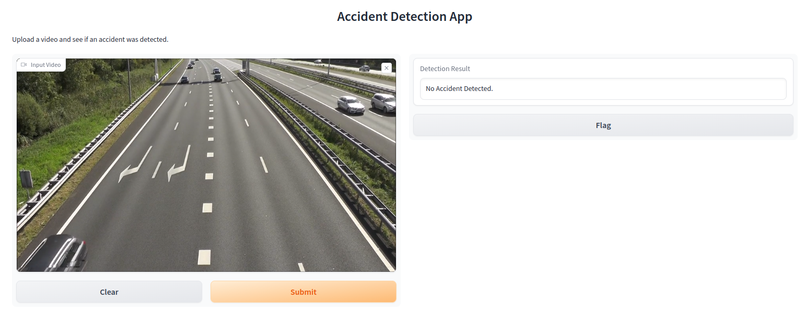
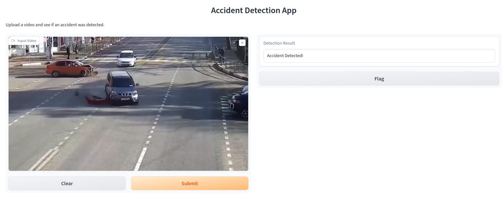

# Accident Detection using ResNet-50 and Gradio

This repository contains a Gradio app that allows users to upload a video and detects if there was an accident in the video. The model behind this application is based on the ResNet-50 architecture and has undergone several optimization processes, to ensure swift and accurate detections.

## Model Training and Optimization

1. **Initial Training with ResNet-50**:
    - Trained on ResNet-50 architecture for 5 epochs.
    - Utilized resources available on Intel Dev Cloud.
    
2. **Optimization with IPEX**:
    - Optimized the model using Intel's PyTorch extension, IPEX, to improve the performance on Intel hardware.
    - Continued training the IPEX-optimized model for another 15 epochs.
    
3. **Conversion to ONNX**:
    - Converted the PyTorch model to ONNX format to make it compatible with a variety of platforms.

4. **Optimization with OpenVINO**:
    - Used Intel's OpenVINO toolkit to further optimize the ONNX model for faster inferencing.

## Gradio App

The Gradio app provides an intuitive interface for users to:
- Upload a video.
- Process the video through the optimized model.
- Get a feedback on whether an accident was detected in the uploaded video.
- If over 10% of the video frames consisted of an accident, "Accident" will be declared, else "No Accident".

## Installation and Usage

1. **Clone the Repository**:
   ```bash
   git clone git@github.com:SSKlearns/IntelOneAPI.git
   cd IntelOneAPI
   ```

2. **Run the Gradio App**:
   ```bash
   python app.py
   ```

4. **Use the App**:
   - Open the provided link in your browser.
   - Upload a video and wait for the model to process it.
   - Review the results to see if an accident was detected.

## Demo

<p align="center">


</p>

## Contributing

Feel free to submit issues, fork the repository and send pull requests!

## License

This project is licensed under the terms of the [MIT license](LICENSE).
